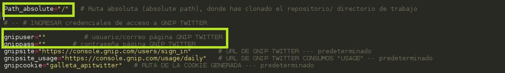
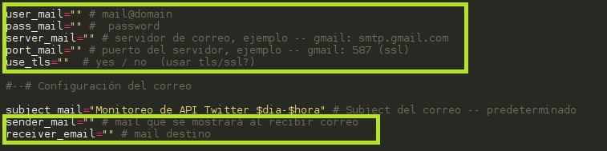

# SX_GNIPCONSUMOS

Herramienta para monitorear los consumos que se van generando cada determinado tiempo desde la plataforma empresarial de GNIP PowerTrack de Twitter (https://console.gnip.com/users/sign_in).

PowerTrack provee covertura completa en tiempo real de los tweets generados sin restricciones por medio de keywords a peticiones vía API, sin embargo la presente herramienta funciona para monitorear de manera gráfica nuestro consumo de créditos y observar el uso de los mismos cada día.

Funcionalidades:

* Instalador para implementar de inmediato.
* Genera un directorio web para observar la tabla de consumos y gráfica (usa canvas js trial versión).
* La interfaz de inicio muestra consumo del mes en curso con posibilidad de consultar consumo por día guardado en la DB.
* La vista y tabla por día se actualiza en tiempo real sin necesidad de refrescar, ideal para monitores de actividad.
* Puedes generar notificaciones por correo cada determinado tiempo para estar al tanto del uso de tus créditos.

Requerimientos para instalador:

* Servidor LAMP instalado (recomendable PHP 7.0 y MariaDB 10.1, Apache cualquier versión).
* Instalador diseñado para distribuciones basadas en Debian (puedes instalar manual o editar el fichero para otras distribuciones)

Dependencias y paquetes desde el instalador:

* Curl
* Gnome-web-photo
* Sendemail
* Instalación de carpetas en directorio web y espacio de trabajo

Instalación y uso:

Clona el repositorio o descargalo en un directorio fijo, abre el archivo de instalación (install.sh) y agrega los datos necesarios para la conexión, posteriormente puedes ejecutar la instalación.

Agrega los mismos valores al script "gniptwitter.sh", si requieres notificaciones activa la opción y agrega los datos del servidor SMTP en "notificaciones.sh".

Si usaste el instalador y agregaste el resto de los datos, el proceso se empezará a ejecutar automáticamente en el tiempo que has asignado, recomendable dar permisos de ejecución a los scripts ".sh". Si lo consideras necesario, puedes eliminar el directorio "install_temp".

Datos a llenar del instalador:

Datos a llenar de gniptwitter.sh

Datos a llenar de notificaciones.sh

